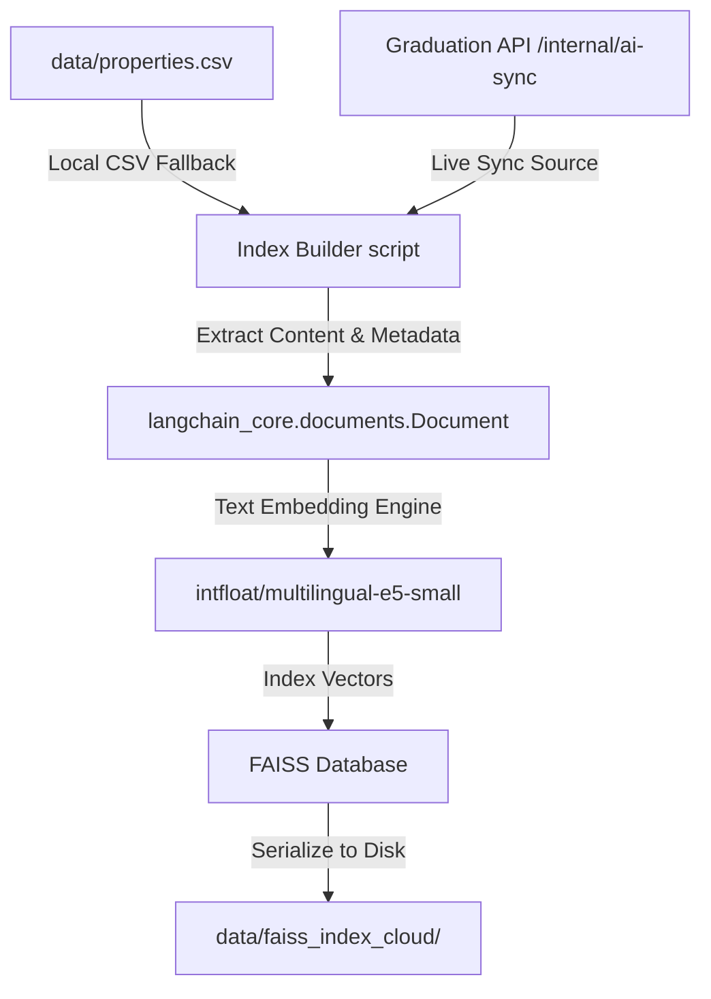

# Aqar-AI: Smart Real Estate Broker
## Comprehensive System Architecture & Technical Documentation

Aqar-AI is an advanced, production-grade conversational Retrieval-Augmented Generation (RAG) assistant tailored specifically for the Egyptian real estate market. The platform leverages a state-of-the-art hybrid search (dense semantic vector retrieval + sparse lexical keyword search), structured parameter extraction via LLM function calling, geospatial mapping services, and a dedicated expert broker persona to deliver precise, natural-language real estate recommendations in Egyptian Arabic.

---

## 🛠️ Technology Stack & Packages

The system uses a modern, modular Python stack designed for fast inference, offline embedding caching, and responsive UI rendering.

| Layer | Technology / Package | Version / Purpose |
| :--- | :--- | :--- |
| **Frontend UI** | [Streamlit](https://streamlit.io/) | Interactive web interface with custom CSS for elegant, right-to-left (RTL) Arabic layout and dynamic component state management. |
| **API Framework** | [FastAPI](https://fastapi.tiangolo.com/) | High-performance, clean architecture REST API framework with asynchronous router support. |
| **Server Gateway** | [Uvicorn](https://www.uvicorn.org/) | Lightning-fast ASGI web server implementation. |
| **Orchestration / LLM**| [LangChain](https://www.langchain.com/) | System prompting, chat history memory management, custom Pydantic structured output chains, and LLM orchestration. |
| **Vector Database** | [FAISS (faiss-cpu)](https://github.com/facebookresearch/faiss) | High-efficiency dense vector search index for semantic retrieval. |
| **Lexical Search** | [rank-bm25](https://pypi.org/project/rank-bm25/) | BM25 Okapi model implementation for high-recall sparse keyword queries. |
| **Embedding Model** | `intfloat/multilingual-e5-small` | Highly efficient 384-dimensional multilingual text embedding model cached locally. |
| **Primary LLM** | `openai/gpt-oss-120b` (via Groq API) | Ultra-low latency inference engine configured for elegant, direct Egyptian Arabic broker reasoning. |
| **Fallback LLM** | `mistralai/Mixtral-8x7B-Instruct-v0.1` | Hugging Face Hub endpoint fallback model in case of Groq API key absence or rate limits. |
| **Geospatial Lookup** | OpenStreetMap (OSM) | Nominatim API for geocoding; Overpass API for dynamic nearby POI (Point of Interest) discovery. |
| **Data / Validation** | `pydantic` & `pydantic-settings` | Structured schema definition, env-var parsing, and type validation. |

---

## 📐 System Architecture & Flow

Aqar-AI implements a robust, decoupling pattern separating ingestion/indexing from runtime query execution.

### 1. Ingestion & Indexing Pipeline (build_index.py)


### 2. Runtime Conversational RAG Workflow

```mermaid
sequenceDiagram
    autonumber
    actor User as User (Streamlit App)
    participant API as FastAPI Backend
    participant RAG as RAG Service
    participant FE as Filter Engine
    participant VS as Vector Store Manager
    participant MAP as Map Intelligence
    participant LLM as LLM Manager (Groq)

    User->>API: Post message /api/v1/chat
    API->>RAG: get_recommendation(message, session_id)
    RAG->>RAG: Classify intent (Greeting/Stats/Analyze vs Search)
    
    rect rgb(20, 30, 45)
        note right of FE: Extract Query Constraints
        RAG->>FE: extract_filters(query)
        FE->>LLM: Structured Pydantic Tool Calling (SearchFilters)
        LLM-->>FE: Parsed JSON (location, budget, rooms, services, intent)
        FE-->>RAG: Structured filters (fallback to Regex if LLM fails)
    end
    
    rect rgb(30, 20, 45)
        note right of VS: Hybrid Search & Reciprocal Rank Fusion
        RAG->>VS: hybrid_search(query, k=120)
        VS->>VS: Dense Search (FAISS) + Sparse Search (BM25 Okapi)
        VS->>VS: Reciprocal Rank Fusion (RRF) on top 240 results
        VS-->>RAG: Ranked & Enriched Documents list
    end
    
    rect rgb(20, 45, 30)
        note right of RAG: Geospatial & Financial Scoring
        RAG->>RAG: Filter & Relax Constraints (padding logic holding location boundary)
        RAG->>MAP: geocode_area_center(requested_location)
        MAP-->>RAG: Coordinate center (lat, lon)
        RAG->>MAP: get_nearby_services(lat, lon) for top properties
        MAP-->>RAG: Dynamic live POIs (malls, metro, schools)
        RAG->>RAG: Compute Composite Score (distance + value-for-money + services + budget)
    end
    
    RAG->>LLM: Invoke conversational templates with history & context
    LLM-->>RAG: Elegant Arabic Broker reply + [SHOW_CARDS] tag
    RAG-->>API: ChatResponse (answer, properties)
    API-->>User: Visual render of cards, maps, and text
```


---

## 📂 Codebase & Module Specifications

### 1. `backend/app/core/config.py` (Settings Class)
Uses Pydantic-Settings to load and validate variables from the `.env` file.
*   **Key Attributes**:
    *   `faiss_index_path`: Path to FAISS database folder (`data/faiss_index_cloud`).
    *   `map_api_enabled`: Flag toggling OpenStreetMap integrations.
    *   `fast_filter_extraction` / `fast_property_responses`: Performance toggles allowing quick regex heuristic routing and cached static text replies.
    *   `chat_retrieval_k` (120), `search_retrieval_k` (200): Deep search buffers.
    *   `llm_max_tokens` (700): Controls Groq response budgets.

---

### 2. `backend/app/services/vector_store.py` (`VectorStoreManager` Class)
Manages the FAISS disk storage, BM25 memory cache, catalog data loading, and hybrid search.

*   **`__init__(self)`**:
    1.  Initializes embedding model (`intfloat/multilingual-e5-small`) using local cache directory `.cache/huggingface` to ensure robust file system operations on restricted servers.
    2.  Loads structured rows from local CSV `data/properties.csv` and merges active properties from external graduation API `/internal/ai-sync` for schema enrichment.
    3.  Loads local FAISS index from disk.
    4.  Caches catalog mappings (`property_lookup`, `property_signature_lookup`) to resolve missing metadata.
    5.  Tokenizes all loaded documents to spin up a native in-memory `BM25Okapi` sparse keyword search index.
*   **`hybrid_search(self, query: str, k: int)`**:
    *   Queries semantic vectors via `FAISS.similarity_search` at $2K$ depth.
    *   Queries `BM25Okapi` search at $2K$ depth.
    *   Calculates unified Reciprocal Rank Fusion (RRF) scores:
        $$\text{RRF Score}(d) = \sum_{m \in \{\text{FAISS}, \text{BM25}\}} \frac{1}{\text{Rank}_m(d) + 60}$$
    *   Sorts all combined findings by RRF score descending.
*   **`_enrich_docs(self, docs: List[Document])`**:
    *   Maps raw retrieved documents to catalog metadata matching URLs or title-description hashes.
    *   Fills in prices, bedroom/bathroom counts, exact sizes, geo-coordinates, and parses local description text to extract pre-existing services tags (such as `security`, `green_spaces`, `schools`).

---

### 3. `backend/app/services/filter_engine.py` (`FilterEngine` Class)
Parses highly conversational user messages to extract structured Search filters.

*   **`extract_filters(self, query: str, available_locations: set, ...)`**:
    *   Executes an LLM-based tool calling chain mapping conversational parameters to a strict **`SearchFilters`** Pydantic schema:
        ```python
        class SearchFilters(BaseModel):
            location: Optional[str]      # Mapped to exact catalog English name
            min_price: Optional[float]
            max_price: Optional[float]
            min_bedrooms: Optional[int]
            max_bedrooms: Optional[int]
            property_type: Optional[str] # apartment, villa, duplex, chalet, studio
            listing_intent: Optional[str]# rent, buy
            desired_services: Optional[list[str]] # schools, hospitals, transport, etc.
        ```
    *   **Regex Fallback (`_extract_filters_regex`)**: Used as a zero-latency heuristic path or if Groq fails. Employs robust pattern matching to catch Arabic expressions for bedrooms (e.g., "غرفتين" $\rightarrow 2$), budgets in millions (e.g., "5 مليون" $\rightarrow 5,000,000$), listing intents (e.g., "إيجار" $\rightarrow$ `rent`), and property type terms (e.g., "دوبلكس" $\rightarrow$ `duplex`).

---

### 4. `backend/app/services/map_intelligence_service.py` (`MapIntelligenceService` Class)
Dynamic connection driver for OpenStreetMap APIs with active result caching.

*   **`geocode_area_center(self, location_name: str)`**:
    *   Translates common Egyptian listing terms to descriptive Nominatim queries (e.g., "التجمع الخامس" $\rightarrow$ "Fifth Settlement, New Cairo, Cairo, Egypt").
    *   Queries OSM search endpoint and returns decimal latitude and longitude coordinates.
*   **`get_nearby_services(self, lat: float, lon: float)`**:
    *   POSTs structured Overpass API queries searching for child amenities (e.g., schools, hospitals, police, public transport, parks, malls) within a $2000\text{m}$ radius of the coordinate.
    *   **Tag Mapping (`_map_tags_to_services`)**: Maps dynamic OSM nodes to catalog service tags:
        *   `amenity: school/university` $\rightarrow$ `schools`
        *   `amenity: hospital/clinic/pharmacy` $\rightarrow$ `hospitals`
        *   `amenity: police` $\rightarrow$ `security`
        *   `shop: mall/supermarket` $\rightarrow$ `commercial_area`
        *   `public_transport / railway` $\rightarrow$ `transport`
        *   `leisure: park/garden` $\rightarrow$ `green_spaces`

---

### 5. `backend/app/services/rag_service.py` (`RAGService` Class)
The brain of Aqar-AI. Orchestrates parameter extraction, indexing queries, constraint backoffs, dynamic scoring, and response synthesis.

*   **`get_recommendation(self, query: str, session_id: str)`**:
    *   Executes high-level query pipeline:
        1.  **Intent Classification**: Evaluates if the query is a friendly greeting, a request for inventory statistics, market coverage, dynamic scoring calculations, or a real estate property search.
        2.  **Filter Extraction**: Invokes `FilterEngine`.
        3.  **Retrieval**: Fetches hybrid documents via `VectorStoreManager`.
        4.  **Constraint Padding (`_enforce_padding_logic`)**: If strict price/bedroom filters return $0$ items, it gracefully relaxes constraints. Crucially, it prioritizes keeping the geographical boundaries intact (retaining properties in the requested location) while softening financial/size requirements.
        5.  **Geo-aware Dynamic Scoring (`_rank_recommendations`)**: Calculates a dynamic recommendation score ($0.0$ to $1.0$) for each candidate:
            *   *Distance Score* ($35\%$): Proximity to calculated location center using the **Haversine formula**:
                $$d = 2R \arcsin\left(\sqrt{\sin^2\left(\frac{\Delta\phi}{2}\right) + \cos\phi_1\cos\phi_2\sin^2\left(\frac{\Delta\lambda}{2}\right)}\right)$$
            *   *Service Score* ($25\%$): Overlap ratio of user requested services compared to both static catalog tags and dynamic live OSM Overpass amenities.
            *   *Value Score* ($25\%$): Compares the property's price-per-square-meter (ppsqm) against the median price-per-square-meter of all matched properties in that specific micro-market. Properties below the median market rate get a maximum value score of $1.0$.
            *   *Budget Score* ($15\%$): Matches budget tolerance. Below budget gives $1.0$, slightly above (within $10\%$) yields $0.7$, and far above scales down to $0.0$.
        6.  **Response Generation (`_generate_response`)**: Invokes ChatGroq with a dedicated system prompt framing "AqarAI" as a practical, direct, and elite broker. If property cards are valid, it appends the `[SHOW_CARDS]` trigger to notify Streamlit.
*   **`analyze_market(self, query: str, explicit_filters: Dict)`**:
    *   Calculates detailed aggregate metrics on matched properties: average/median prices, price per square meter, average bedrooms, and counts.
    *   Groups properties to find top locations and property types (Segment Stats).
    *   **Buy/Wait Recommendation (`_compute_buy_decision`)**: Produces a practical signal (e.g., `buy_now`, `wait_or_negotiate`, `not_now`) with a confidence level based on budget affordability ratio and percentage of properties below the market median rate.
    *   **Standalone Alternative (`_identify_better_option`)**: Dynamically flags a "standout property" that offers the best blend of price, services, and location, explaining exactly why it is a stronger alternative.

---

### 6. `backend/app/api/v1/` (API Routers)
FastAPI endpoints mapping incoming HTTP payloads to `RAGService` calls:
*   `POST /api/v1/chat`: Handles conversational message exchanges (`ChatRequest` $\rightarrow$ `ChatResponse`).
*   `POST /api/v1/search`: Handles pure headless filtering queries without generating conversational chat texts (`SearchRequest` $\rightarrow$ `SearchResponse`).
*   `POST /api/v1/recommend/similar`: Returns structurally similar items based on text descriptions or session interest lists.
*   `POST /api/v1/analyze`: Returns detailed market statistics, Buy/Wait decisions, and standout alternative selections.
*   `POST /api/v1/interactions/property-click`: Registers a click/favorite interest signal to dynamically alter subsequent recommendations in that session.

---

## 🎨 Frontend UI Flow & Interaction

The interface (`src/app.py`) is built using **Streamlit** styled with premium CSS overrides to generate a dark-mode glassmorphic theme tailored for Arabic-speaking users.

```
+------------------------------------------------------------+
|  🏙️ Aqar AI Sidebar       |   👋 أهلاً بيك في Aqar AI       |
|  ------------------       |   ---------------------        |
|  حالة النظام: 🟢 متصل      |   المساعد العقاري الذكي...      |
|                           |                                |
|  🔄 Reset Chat Button     |   💬 Chat Bubble (Persona AI)  |
|                           |   "يا مرحب! أنا Aqar جاهز..."  |
|  💡 Quick Tips:           |                                |
|  - شقة في التجمع بـ 5 مليون|   💬 Chat Bubble (User)        |
|  - أرخص شقة في زايد       |   "عايز شقة في التجمع 3 غرف"   |
|                           |                                |
|                           |   💬 Chat Bubble (Response)    |
|                           |   "تمام، دي أفضل النتائج..."   |
|                           |   +--------------------------+ |
|                           |   | [Image Preview]          | |
|                           |   | 3,500,000 جنيه   📍التجمع| |
|                           |   | 🛏️ 3 غرف  🚿 2 حمام     | |
|                           |   | 🔗 تفاصيل  🗺️ خريطة      | |
|                           |   | ⭐ مهتم (Button)          | |
|                           |   +--------------------------+ |
+------------------------------------------------------------+
```

### Key UI Features:
1.  **Custom RTL Arabic Styling**: Integrates Arabic fonts `Cairo` and `Tajawal`, forces strict Right-to-Left alignment on inputs, chat bubbles, bullet lists, and cards, and applies smooth hover micro-animations.
2.  **Visual Property Cards**: Shows property listing images, highlights prices, bedrooms, sizes, and maps out interactive coordinates.
3.  **OSM Static Map Previews**: Renders localized map graphics with red pushpin indicators for every listing with valid coordinate dimensions.
4.  **"⭐ Interested" Interactions**: When clicked, the frontend POSTs to `/interactions/property-click` and automatically fetches similar recommendations, presenting them instantly as natural follow-ups in the chat stream.

---

## 🔄 End-to-End Execution Trace

To illustrate the entire system in action, here is the chronological trace of a user request:

> **User Query**: *"عايز شقة إيجار في التجمع الخامس ميزانية 20 ألف"*
> (I want an apartment for rent in the Fifth Settlement with a budget of 20,000)

```
[User Input] "عايز شقة إيجار في التجمع الخامس ميزانية 20 ألف"
     │
     ▼
[Streamlit app.py] ──(POST payload)──> [/api/v1/chat]
                                            │
                                            ▼
                                  [FastAPI chat_endpoint] 
                                            │
                                            ▼
                                  [RAGService.get_recommendation]
                                            │
                                            ▼
                                  [FilterEngine.extract_filters]
                                  • Uses LLM Function calling
                                  • Extracts:
                                    - location: "The 5th Settlement"
                                    - max_price: 20000.0
                                    - property_type: "apartment"
                                    - listing_intent: "rent"
                                            │
                                            ▼
                                  [VectorStoreManager.hybrid_search]
                                  • Semantic FAISS Query: "passage: Title: apartment in The 5th Settlement..."
                                  • Keyword BM25 Query: ["شقة", "إيجار", "التجمع", "الخامس"]
                                  • Reciprocal Rank Fusion blending
                                            │
                                            ▼
                                  [RAGService._enforce_padding_logic]
                                  • Filters properties by location & price
                                  • (If no 20k apartments, relax price constraint to 25k,
                                     but strictly preserve "The 5th Settlement" location boundary)
                                            │
                                            ▼
                                  [RAGService._rank_recommendations]
                                  • Geocodes "The 5th Settlement" -> (30.013, 31.428)
                                  • Calculates Haversine distances for candidates
                                  • Checks price compared to Fifth Settlement median sqm rent
                                  • Overlap matching tags (security, green_spaces)
                                  • Produces composite scores
                                            │
                                            ▼
                                  [RAGService._generate_response]
                                  • ChatGroq generates broker text in Egyptian Arabic:
                                    "تمام يا غالي، لقيت لك شقق إيجار ممتازة في التجمع الخامس..."
                                  • Appends [SHOW_CARDS] at the end
                                            │
                                            ▼
[Streamlit app.py] <──(ChatResponse)───────┘
• Renders beautiful conversational broker text
• Detects [SHOW_CARDS] and renders visual property cards with photos, details, and dynamic OSM maps
```
