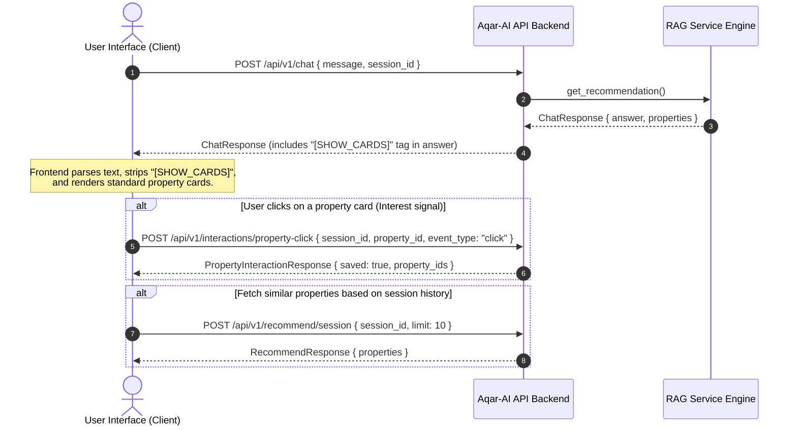

# Aqar-AI Backend: Frontend Integration & API Documentation 🚀
## Overview for Frontend Developers

Welcome to the **Aqar-AI** Backend API documentation. This guide is designed to help frontend developers seamlessly integrate with the Aqar-AI smart real estate broker backend services.

The Aqar-AI backend is a FastAPI application that provides:
- **Conversational RAG Chat** with automated real estate recommendations.
- **Headless Semantic Search** with flexible filters.
- **Similar Property Recommendations** powered by dense vector embeddings.
- **Interaction-Aware Sessions** to track clicks and refine recommendations.
- **Market Analytics & Standout Alternatives** (including buy/wait decisions).
- **Geospatial map connectivity checks** using OpenStreetMap.

---

## 🌐 Base Connection Details

* **Base URL**: `http://localhost:8000/api/v1` (or your configured environment host)
* **Headers**: `Content-Type: application/json`
* **CORS Policy**: Configured to allow all origins (`*`) by default unless restricted in `.env`.
* **Interactive Docs**: The backend automatically generates interactive Swagger UI and ReDoc documentation:
  - **Swagger UI**: `http://localhost:8000/docs`
  - **ReDoc**: `http://localhost:8000/redoc`
  - **OpenAPI Schema JSON**: `http://localhost:8000/openapi.json`

---

## 🔄 Core Frontend-Backend Flow

The diagram below illustrates how a client application coordinates chat sessions, renders property listings, and reports user interactions back to the AI recommendation engine:



---

## 🛠️ Key UI Parsing & Session Strategies

### 1. The `[SHOW_CARDS]` Tag Strategy
When a user asks for properties (e.g. `"عايز شقة في التجمع"`), the backend conversational model generates an Egyptian Arabic explanation and appends the string `[SHOW_CARDS]` at the very end of the `answer` field. 

**Frontend Action Plan:**
1. Check if the `answer` string contains the `[SHOW_CARDS]` substring.
2. **If present:** 
   - Strip the `[SHOW_CARDS]` tag out of the text before displaying it in the chat bubble.
   - Render the objects inside the `properties` array below the chat bubble as beautiful visual property cards (with images, prices, bedroom counts, sizes, and maps).
3. **If absent:**
   - Display the text as-is and do not render any cards (or display an empty state message if the list is empty).

### 2. Session ID (`session_id`) Lifecycle
To maintain context, search criteria memory, and interaction history:
- Generate a unique session ID (e.g., UUID or timestamp-based string like `session_1718381234`) on the frontend when the user opens the application.
- Pass this `session_id` in the payload of **`/api/v1/chat`**, **`/api/v1/interactions/property-click`**, and **`/api/v1/recommend/session`**.
- This ensures the AI remembers past queries (e.g., if the user says `"عايزها 3 غرف"` after a previous query about New Cairo, it remembers the location context).

---

## 📋 Data Models (Schemas)

Below are the primary data structures returned by the Aqar-AI backend. Refer to [schemas.py](file:///home/eiad/Projects/Aqar-AI/backend/app/models/schemas.py) for the direct Pydantic definitions.

### 🏠 Property Model
Represents a single real estate listing. All property arrays in API responses conform to this structure:

| Field | Type | Required? | Description |
| :--- | :--- | :--- | :--- |
| `id` | `integer` or `null` | Yes | Unique ID of the property listing. Useful for click-tracking. |
| `title` | `string` | Yes | Headline / name of the property. |
| `location` | `string` | Yes | General area name (e.g., "التجمع الخامس", "Sheikh Zayed"). |
| `price` | `number` | Yes | Cost in EGP (Egyptian Pounds). |
| `bedrooms` | `integer` | Yes | Number of bedrooms. |
| `bathrooms` | `integer` | Yes | Number of bathrooms. |
| `size` | `number` | Yes | Area of the property in square meters (sqm). |
| `image_url` | `string` | Yes | URL pointing to the property thumbnail/image. |
| `description` | `string` | Yes | Short text snippet describing the property listing. |
| `url` | `string` | Yes | Direct external link to the listing source page (or `#`). |
| `latitude` | `number` or `null` | No | Exact GPS Latitude (if geocoded or available). |
| `longitude` | `number` or `null` | No | Exact GPS Longitude (if geocoded or available). |
| `distance_km` | `number` or `null` | No | Calculated distance in km from the user's requested location center. |
| `nearby_services` | `array of strings` | Yes | Facilities near the property (e.g., `["schools", "malls", "transport"]`). |
| `recommendation_score` | `number` or `null` | No | Calculated relevance score (between `0.0` and `1.0`). |

### 📊 SegmentStat Model
Aggregated inventory statistics for a specific category:

| Field | Type | Description |
| :--- | :--- | :--- |
| `name` | `string` | Name of the segment (e.g., location name or property type). |
| `count` | `integer` | Number of properties matching this segment. |
| `avg_price` | `number` | Average price within this segment. |
| `median_price` | `number` | Median price within this segment. |
| `avg_price_per_sqm` | `number` | Average price per square meter. |

### 💡 BuyDecision Model
Structured AI broker advice concerning the selected market query:

| Field | Type | Description |
| :--- | :--- | :--- |
| `decision` | `string` | Actionable decision (e.g. `buy_now`, `wait_or_negotiate`, `not_now`). |
| `headline` | `string` | A concise Arabic recommendation headline. |
| `confidence` | `number` | Score between `0.0` and `1.0` representing confidence level. |
| `reasons` | `array of strings`| Bullet points in Arabic justifying the recommendation. |

---

## ⚡ API Endpoint Details

### 1. POST `/api/v1/chat`
* **Purpose**: Primary endpoint for the conversational interface. Handles natural language questions, extracts parameters, ranks properties, and returns conversational Arabic answers.
* **Payload (`ChatRequest`)**:
```json
{
  "message": "عايز شقة 3 غرف في التجمع الخامس تحت 5 مليون",
  "session_id": "session-unique-12345"
}
```
* **Response (`ChatResponse`)**:
```json
{
  "answer": "يا مرحب بيك يا فندم! لقيت لك شقق ممتازة في التجمع الخامس بـ 3 غرف نوم وتناسب الميزانية المطلوبة. بص على الخيارات دي وقولي رأيك: [SHOW_CARDS]",
  "properties": [
    {
      "id": 4821,
      "title": "شقة للبيع بالتجمع الخامس 160م تشطيب كامل",
      "location": "New Cairo - El Tagamoa El Khames",
      "price": 4200000.0,
      "bedrooms": 3,
      "bathrooms": 2,
      "size": 160.0,
      "image_url": "http://localhost:8000/uploads/property_4821.jpg",
      "description": "شقة ممتازة في قلب التجمع الخامس قريبة من التسعين الجنوبي والخدمات...",
      "url": "http://localhost:8000/property/4821",
      "latitude": 30.0125,
      "longitude": 31.4312,
      "distance_km": 0.85,
      "nearby_services": ["schools", "commercial_area", "transport"],
      "recommendation_score": 0.94
    }
  ]
}
```

---

### 2. POST `/api/v1/search`
* **Purpose**: Headless search endpoint. Bypasses the conversational AI text generation to quickly return property arrays and lists the filters parsed by the engine.
* **Payload (`SearchRequest`)**:
```json
{
  "query": "شقة 3 غرف في التجمع قريبة من المدارس",
  "location": "New Cairo",
  "min_price": 2000000.0,
  "max_price": 6000000.0,
  "min_bedrooms": 3,
  "max_bedrooms": 4,
  "property_type": "apartment",
  "desired_services": ["schools", "hospitals"]
}
```
*Note: The frontend can send a raw `query` string, explicit UI fields, or a combination of both.*

* **Response (`SearchResponse`)**:
```json
{
  "properties": [
    {
      "id": 4821,
      "title": "شقة للبيع بالتجمع الخامس 160م تشطيب كامل",
      "location": "New Cairo - El Tagamoa El Khames",
      "price": 4200000.0,
      "bedrooms": 3,
      "bathrooms": 2,
      "size": 160.0,
      "image_url": "http://localhost:8000/uploads/property_4821.jpg",
      "description": "شقة ممتازة في قلب التجمع الخامس قريبة من التسعين الجنوبي والخدمات...",
      "url": "http://localhost:8000/property/4821",
      "latitude": 30.0125,
      "longitude": 31.4312,
      "distance_km": 0.85,
      "nearby_services": ["schools", "commercial_area"],
      "recommendation_score": 0.88
    }
  ],
  "filters_used": {
    "location": "New Cairo",
    "min_bedrooms": 3,
    "max_price": 6000000.0,
    "desired_services": ["schools"]
  }
}
```

---

### 3. POST `/api/v1/interactions/property-click`
* **Purpose**: Call this endpoint whenever a user clicks "Interested", "View Details", or custom interaction triggers on a property card. This registers user interest on the backend to customize future recommendation scores.
* **Payload (`PropertyInteractionRequest`)**:
```json
{
  "session_id": "session-unique-12345",
  "property_id": 4821,
  "event_type": "click"
}
```
* **Response (`PropertyInteractionResponse`)**:
```json
{
  "saved": true,
  "session_id": "session-unique-12345",
  "property_ids": [4821]
}
```

---

### 4. POST `/api/v1/recommend/session`
* **Purpose**: Fetches property recommendations tailored to the user's active session interaction list (e.g. similar properties to the ones they clicked).
* **Payload (`SessionRecommendRequest`)**:
```json
{
  "session_id": "session-unique-12345",
  "property_ids": [4821],
  "limit": 10
}
```
*Note: `property_ids` is optional. If passed, it acts as an override or additional signal list.*

* **Response (`RecommendResponse`)**:
```json
{
  "properties": [
    {
      "id": 9214,
      "title": "شقة مودرن بحديقة بالتجمع",
      "location": "New Cairo",
      "price": 4500000.0,
      "bedrooms": 3,
      "bathrooms": 2,
      "size": 175.0,
      "image_url": "http://localhost:8000/uploads/property_9214.jpg",
      "description": "شقة أرضي بحديقة خاصة بموقع مميز بالتجمع الخامس...",
      "url": "http://localhost:8000/property/9214",
      "latitude": 30.0118,
      "longitude": 31.4295,
      "distance_km": 1.1,
      "nearby_services": ["schools", "security"],
      "recommendation_score": 0.92
    }
  ]
}
```

---

### 5. POST `/api/v1/recommend/similar`
* **Purpose**: Look up semantically similar properties based on a raw text description or direct fallback to session interaction lists.
* **Payload (`RecommendRequest`)**:
```json
{
  "property_description": "شقة 3 غرف تشطيب سوبر لوكس في التجمع الخامس قريبة من التسعين",
  "session_id": "session-unique-12345",
  "property_ids": [],
  "limit": 10
}
```
* **Response (`RecommendResponse`)**:
```json
{
  "properties": [
    {
      "id": 4821,
      "title": "شقة للبيع بالتجمع الخامس 160م تشطيب كامل",
      "location": "New Cairo - El Tagamoa El Khames",
      "price": 4200000.0,
      "bedrooms": 3,
      "bathrooms": 2,
      "size": 160.0,
      "image_url": "http://localhost:8000/uploads/property_4821.jpg",
      "description": "شقة ممتازة في قلب التجمع الخامس قريبة من التسعين الجنوبي والخدمات...",
      "url": "http://localhost:8000/property/4821",
      "latitude": 30.0125,
      "longitude": 31.4312,
      "distance_km": 0.85,
      "nearby_services": ["schools", "commercial_area"],
      "recommendation_score": 0.95
    }
  ]
}
```

---

### 6. POST `/api/v1/analyze`
* **Purpose**: Fetches advanced market metrics, segmented breakdowns, a buy/wait decision, and identifies a standout "better option" based on affordability and proximity. Ideal for a dashboard or market insights page.
* **Payload (`AnalyzeRequest`)**:
```json
{
  "query": "حلل السوق في التجمع الخامس لشقق 3 غرف تحت 6 مليون",
  "location": "New Cairo",
  "min_price": 2000000.0,
  "max_price": 6000000.0,
  "min_bedrooms": 3,
  "max_bedrooms": 3,
  "property_type": "apartment"
}
```
* **Response (`AnalyzeResponse`)**:
```json
{
  "insight": "سوق التجمع الخامس لشقق الـ 3 غرف في فئة متوسطة الميزانية متوازن حالياً. هناك زيادة طفيفة في المعروض مع استقرار نسبي في الأسعار لكل متر مربع.",
  "filters_used": {
    "location": "New Cairo",
    "max_price": 6000000.0,
    "min_bedrooms": 3
  },
  "match_scope": "filtered_subset",
  "total_candidates": 450,
  "matched_count": 42,
  "stats": {
    "avg_price": 4650000.0,
    "median_price": 4500000.0,
    "min_price": 3100000.0,
    "max_price": 5900000.0,
    "avg_size": 168.5,
    "avg_price_per_sqm": 27596.4
  },
  "top_locations": [
    {
      "name": "El Tagamoa El Khames",
      "count": 25,
      "avg_price": 4800000.0,
      "median_price": 4600000.0,
      "avg_price_per_sqm": 28500.0
    },
    {
      "name": "El Narges",
      "count": 17,
      "avg_price": 4430000.0,
      "median_price": 4350000.0,
      "avg_price_per_sqm": 26270.0
    }
  ],
  "top_property_types": [
    {
      "name": "apartment",
      "count": 42,
      "avg_price": 4650000.0,
      "median_price": 4500000.0,
      "avg_price_per_sqm": 27596.4
    }
  ],
  "buy_decision": {
    "decision": "buy_now",
    "headline": "فرصة شراء جيدة جدًا",
    "confidence": 0.85,
    "reasons": [
      "حوالي 60% من الشقق المعروضة معروضة بأسعار أقل من متوسط سعر المتر المعتاد بالمنطقة.",
      "توفر خيارات واسعة في الميزانية المحددة قريبة من الخدمات والمدارس."
    ]
  },
  "better_option_found": true,
  "better_option_reason": "هذه الشقة معروضة بسعر يقل بنسبة 15% عن متوسط سعر المتر في التجمع الخامس، وبها 3 خدمات حيوية مجاورة.",
  "better_option": {
    "id": 7301,
    "title": "شقة لقطة لسرعة البيع بالتجمع",
    "location": "New Cairo - El Tagamoa",
    "price": 3800000.0,
    "bedrooms": 3,
    "bathrooms": 2,
    "size": 155.0,
    "image_url": "http://localhost:8000/uploads/property_7301.jpg",
    "description": "شقة مميزة للغاية بسعر مغري جداً في اللوتس...",
    "url": "http://localhost:8000/property/7301",
    "latitude": 30.0182,
    "longitude": 31.4402,
    "distance_km": 1.4,
    "nearby_services": ["schools", "commercial_area", "hospitals"],
    "recommendation_score": 0.98
  },
  "sample_properties": []
}
```

---

### 7. POST `/api/v1/map/live-check`
* **Purpose**: Verify if the server's geocoding and live POI services are active and fetch coordinates for any arbitrary area.
* **Payload (`MapLiveCheckRequest`)**:
```json
{
  "location": "New Cairo",
  "radius_m": 2000
}
```
* **Response (`MapLiveCheckResponse`)**:
```json
{
  "enabled": true,
  "provider": "OpenStreetMap (Nominatim + Overpass)",
  "needs_api_key": false,
  "geocode_ok": true,
  "nearby_services_ok": true,
  "resolved_location": "New Cairo",
  "resolved_center": {
    "latitude": 30.0298,
    "longitude": 31.4883
  },
  "nearby_services": [
    "schools",
    "commercial_area",
    "hospitals",
    "transportation"
  ],
  "note": "Live check succeeded."
}
```

---

### 8. GET `/health`
* **Purpose**: Verification check for load-balancers or frontend connectivity checks.
* **Response**:
```json
{
  "status": "healthy",
  "version": "2.0.0"
}
```

---

## 🛑 Typical Error Codes & Responses
FastAPI serves standard HTTP exception schemas in the event of an error:

* **`422 Unprocessable Entity`**: Request body format is invalid or missing required keys.
```json
{
  "detail": [
    {
      "loc": ["body", "message"],
      "msg": "field required",
      "type": "value_error.missing"
    }
  ]
}
```
* **`500 Internal Server Error`**: Backend runtime error (e.g. API keys invalid, database read fail).
```json
{
  "detail": "Error description details from backend logs."
}
```
